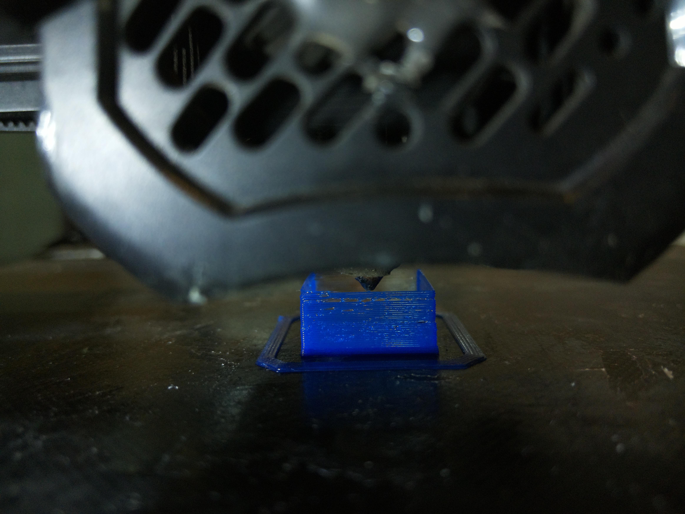
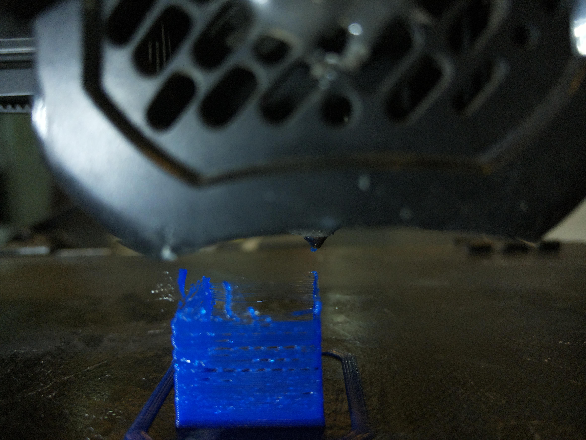
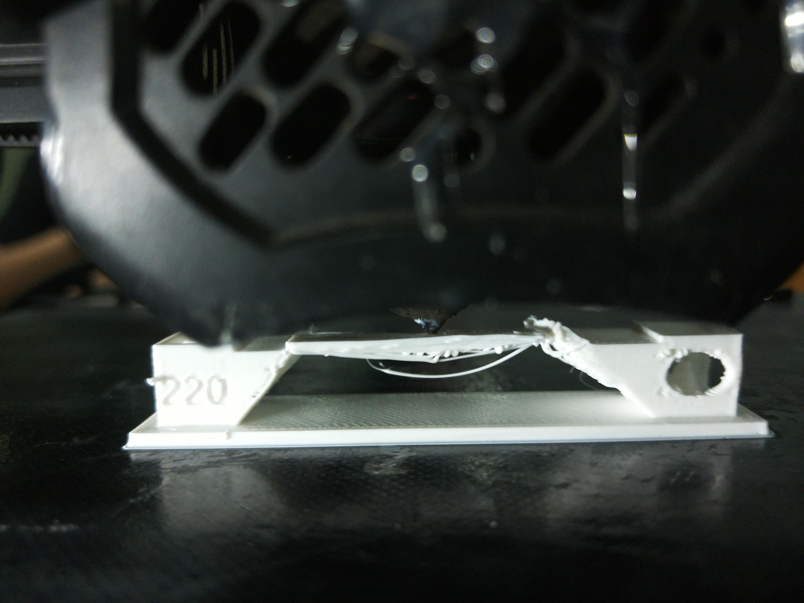
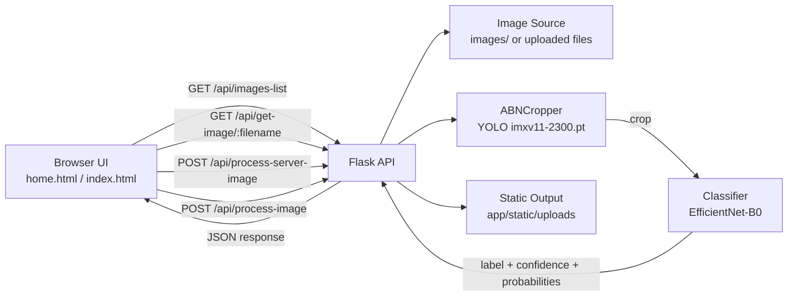

# GateNet AM

AI-powered monitoring for 3D printing failure detection using computer vision and deep learning.

This project is an AI pipeline tailored for edge deployment on a Raspberry Pi, where the device captures photos of an ongoing 3D print and runs failure analysis locally.

For demonstration and collaboration purposes, this GitHub repository contains a demo-friendly version of the pipeline and UI.

## Model Distribution Notice

The trained ML model weights are intentionally not included in this public repository because we do not want to distribute the production models.

The codebase keeps the same loading structure, but you must place your private model files locally (for example in `app/models/`) before running full inference.

## Problem Statement

3D printing failures such as spaghetti, bridging errors, layer shifts, under-extrusion, and bed adhesion issues often appear mid-print and are usually detected too late. This leads to:

- Wasted filament and energy
- Lost machine time
- Failed parts and delayed delivery
- Manual supervision overhead

GateNet AM addresses this by continuously analyzing print frames, detecting anomalies early, and classifying the likely error type with confidence scores.

## Project Overview

GateNet AM is a Flask-based web app with a two-stage AI pipeline:

1. Region detection and crop extraction using a YOLO model
2. Error classification on the cropped anomaly region using an EfficientNet-B0 classifier

The web interface provides:

- A landing page with architecture and concept sections
- A test page that simulates live monitoring from server-side image frames
- Real-time status, detected error name, confidence bar, and anomaly crop preview

## Website Images

### Actual Project Image


### UI and Visual Assets


### Sample Monitoring Frames

The app also reads frames from the `images/` folder for monitoring simulation.





### Website Screenshots (Captured)


## Website Videos

### Demo Recording 1


https://github.com/user-attachments/assets/f52dd9b6-0ee9-49fd-bd5b-22f35f0d8b33


### Demo Recording 2


https://github.com/user-attachments/assets/ce5e2b31-c107-4dae-81bc-3b3cb604f8da


## System Architecture

### High-Level Flow

- Client UI requests monitoring actions from Flask API routes
- Flask pipeline loads and reuses AI models once at startup
- YOLO model detects abnormal print region and generates crop
- EfficientNet classifier predicts error class and confidence
- API returns JSON response to update UI state in near-real-time

### Architecture Diagram (Mermaid)



### Core Components

- `app.py`: application entrypoint (runs Flask on port `3000`)
- `app/__init__.py`: Flask app factory and blueprint registration
- `app/views.py`: web routes (`/` and `/test`)
- `app/pipeline/pipeline.py`: API endpoints and pipeline orchestration
- `app/pipeline/abnv2_single.py`: YOLO-based anomaly cropper
- `app/pipeline/classifier.py`: EfficientNet-based error classifier
- `app/models/`: expected local path for private model weights and class mapping JSON (weights are not publicly distributed in this repo)
- `app/templates/`: UI pages
- `app/static/uploads/`: generated crop outputs during inference
- `images/`: server-side frame source for simulated monitoring

## API Endpoints

| Method | Endpoint | Purpose |
|---|---|---|
| `POST` | `/api/process-image` | Process an uploaded image |
| `POST` | `/api/process-server-image` | Process a selected image from `images/` |
| `GET` | `/api/images-list` | Get available frame filenames |
| `GET` | `/api/get-image/<filename>` | Serve image from `images/` |
| `POST` | `/api/clear-uploads` | Delete generated images in `app/static/uploads/` |

## Tech Stack

- Python 3
- Flask
- PyTorch + TorchVision
- Ultralytics YOLO
- OpenCV
- TailwindCSS (CDN in templates)

## How To Run The Project

### 1. Prerequisites

- Python 3.10+ recommended
- pip
- Windows PowerShell or terminal of choice

### 2. Setup

```powershell
# From project root
python -m venv .venv
.\.venv\Scripts\Activate.ps1
pip install -r requirements.txt
```

### 3. Run

```powershell
python app.py
```

The app starts at:

- `http://127.0.0.1:3000`
- `http://localhost:3000`

### 4. Use

1. Open the landing page `/`
2. Click `Test` to go to `/test`
3. Click `Start Monitoring`
4. The app streams images from `images/`, runs detection/classification, and updates status/results

## Expected Output

For each processed frame/image, the backend returns:

- `abn_detected`: whether anomaly region was found
- `error_type`: predicted class label
- `confidence`: confidence score for predicted class
- `all_probabilities`: class probability distribution
- `crop_url`: path to cropped anomaly image if available

## Team

- Archi
- Arnav
- Rutuparna
- Shubham

## License

MIT License.

See the `LICENSE` file for full text.

